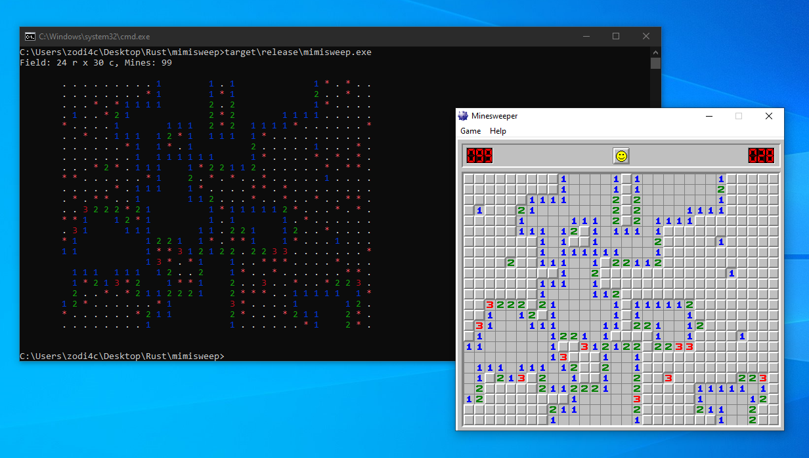

# mimisweep

Implementation of the [`mimikatz`](https://github.com/gentilkiwi/mimikatz) minesweper module, supporting the Windows XP and Windows 7 variants of the game.



## Requirements

Supported operating systems:

- Windows

Software requirements:

- `rustc` v1.70
- `cargo`

## Build

```
git clone https://github.com/zodi4cx/mimisweep
cd mimisweep
cargo build --release
```

## Credits

- Benjamin DELPY ([gentilkiwi](https://github.com/gentilkiwi)), for the development of the original Minesweeper module in [`mimikatz`](https://github.com/gentilkiwi/mimikatz/blob/master/mimikatz/modules/kuhl_m_minesweeper.c).